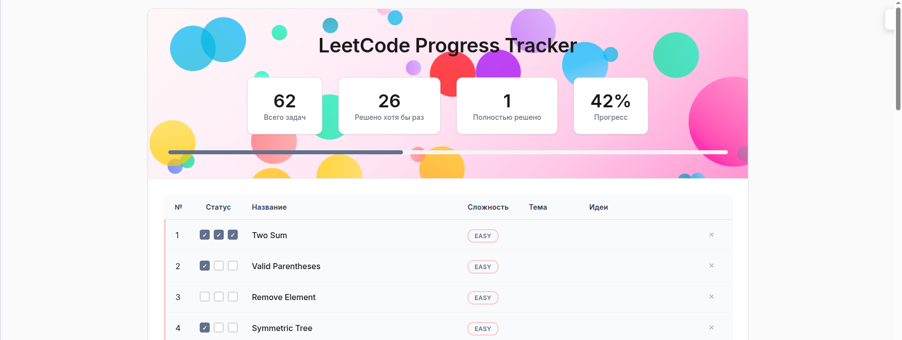

# 🎯 LeetCode Progress Tracker

<div align="center">
  
</div>

Современное веб-приложение для отслеживания прогресса решения задач на LeetCode с красивым интерфейсом и интерактивными элементами.


## ✨ Возможности

### 📊 Управление задачами
- **Добавление задач** - удобная форма для добавления новых задач LeetCode
- **Удаление задач** - возможность удалить ненужные задачи
- **Редактирование** - двойной клик для редактирования темы и идей решения
- **Автоматическая нумерация** - задачи автоматически получают порядковые номера

### 🎯 Отслеживание прогресса
- **Трехуровневая система** - каждая задача может быть решена 3 раза, чтобы лучше запомнить
- **Визуальные индикаторы** - чекбоксы с анимацией для отметки решений
- **Статистика в реальном времени** - автоматический подсчет прогресса

### 🎨 Интерактивный интерфейс
- **Летающие шарики** - анимированные шарики, каждый из которых отображает решённую задачу, размер шариков зависит от сложности задачи. Больше решений - больше гариков!
- **Современный UI** - красивый градиентный дизайн с анимациями

### 📈 Аналитика
- **Общая статистика** - количество задач, решенных и начатых
- **Процент выполнения** - визуальный прогресс-бар

## 🚀 Быстрый старт

### Предварительные требования
- Python 3.8 или выше
- pip (менеджер пакетов Python)

### Установка

1. **Клонируйте репозиторий:**
```bash
git clone <repository-url>
cd leetcode/web
```

2. **Установите зависимости:**
```bash
pip install -r requirements.txt
```

3. **Запустите приложение:**
```bash
python app.py
```

4. **Откройте браузер:**
```
http://localhost:5000
```

## 📁 Структура проекта

```
web/
├── app.py                 # Основное Flask приложение
├── requirements.txt       # Зависимости Python
├── tasks.csv             # База данных задач (CSV формат)
├── templates/
│   └── index.html        # HTML шаблон с полным интерфейсом
└── README.md             # Документация проекта
```

## 🗄️ Формат данных

Приложение использует CSV файл для хранения данных о задачах:

```csv
number,title,difficulty,leetcode_link,theme,ideas,solution_1,solution_2,solution_3
1,Two Sum,Easy,https://leetcode.com/problems/two-sum/,Arrays,Hash map approach,1,1,1
2,Valid Parentheses,Easy,https://leetcode.com/problems/valid-parentheses/,Stack,Use stack to track brackets,1,0,0
```

### Поля данных:
- `number` - порядковый номер задачи
- `title` - название задачи
- `difficulty` - сложность (Easy/Medium/Hard)
- `leetcode_link` - ссылка на задачу в LeetCode
- `theme` - тема/категория задачи
- `ideas` - идеи по решению
- `solution_1`, `solution_2`, `solution_3` - флаги решений (0/1)

## 🎮 Как использовать

### Добавление задачи
1. Нажмите кнопку "Добавить задачу"
2. Заполните форму (название и сложность обязательны)
3. Нажмите "Добавить"

### Отметка решения
1. Кликните на чекбоксы в колонке "Статус"
2. Каждая задача может быть решена 3 способами
3. Прогресс автоматически обновляется

### Редактирование заметок
1. Двойной клик на ячейку "Тема" или "Идеи"
2. Введите новый текст
3. Нажмите Enter для сохранения

### Удаление задачи
1. Нажмите кнопку "×" в правой колонке
2. Подтвердите удаление

## 🤝 Вклад в проект

Мы приветствуем вклад в развитие проекта! Пожалуйста:

1. Форкните репозиторий
2. Создайте ветку для новой функции (`git checkout -b feature/AmazingFeature`)
3. Зафиксируйте изменения (`git commit -m 'Add some AmazingFeature'`)
4. Отправьте в ветку (`git push origin feature/AmazingFeature`)
5. Откройте Pull Request

## 📞 Поддержка

Если у вас есть вопросы или предложения:
- Создайте [Issue](https://github.com/your-repo/issues)
- Напишите на email: alin.serg.as.as@gmail.com

## 🎯 Roadmap

- [ ] Экспорт/импорт данных
- [ ] Темная тема
- [ ] Группировка по темам
- [ ] Статистика по времени решения
- [ ] Интеграция с LeetCode API
- [ ] Мобильное приложение

---

⭐ **Если проект вам понравился, поставьте звезду!**
